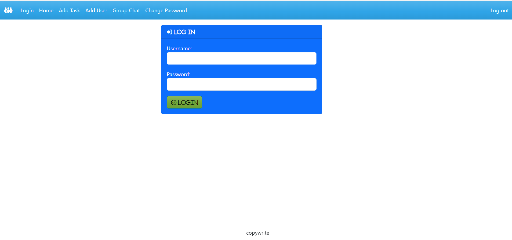
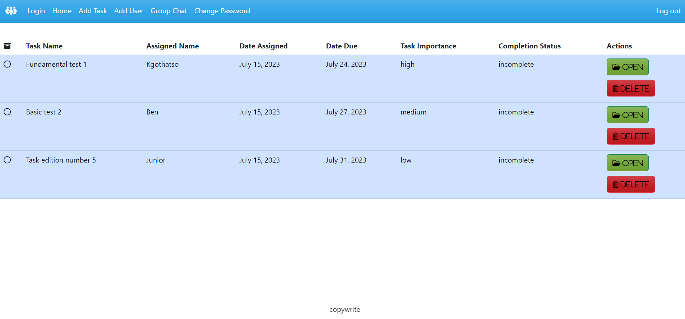
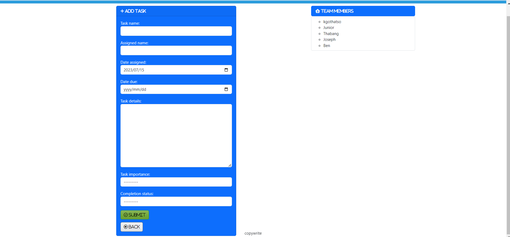
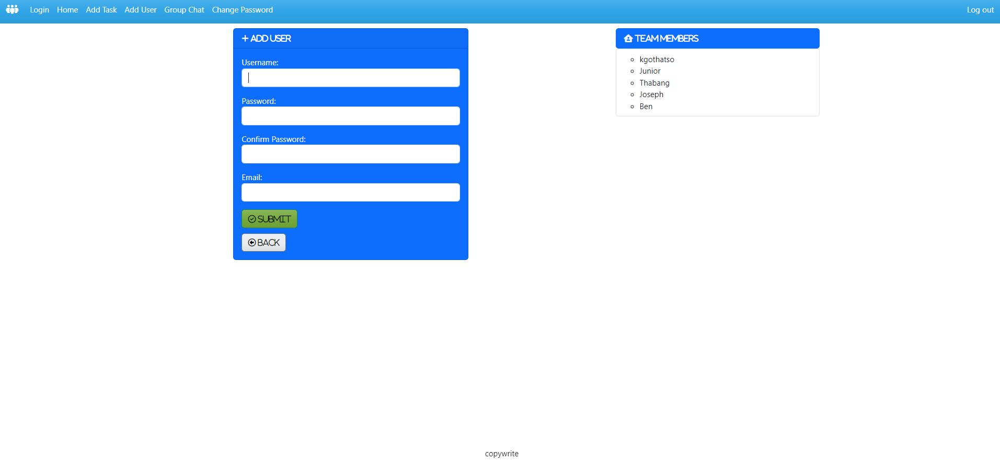
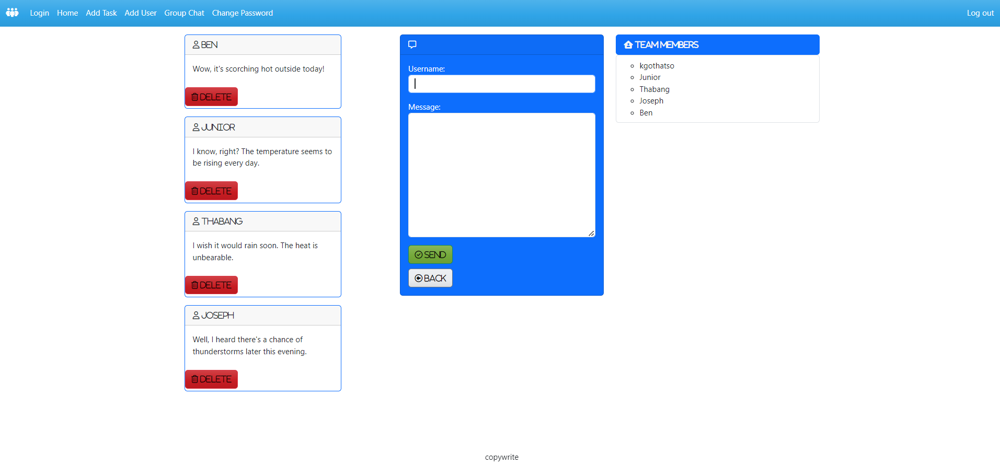
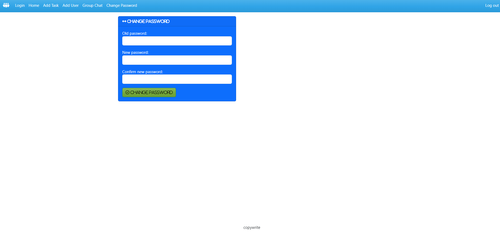
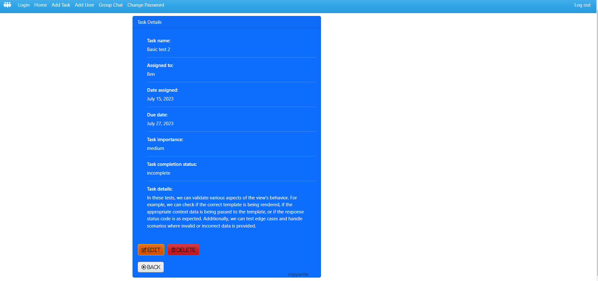

# TeamConnect
A basic management system
This project is a management system designed to be run on a local server using the command prompt (cmd)/Terminal or using Dockerplayground. It utilizes Django, a powerful Python web framework, for the development of the website.
All comments and additional notes related to the project are written within the code itself.

## Prerequisites
Before running this project, make sure you have the following software installed on your system:
- Python (version 3.x)
- Django (version 3.x or higher)

## Installation
- Clone the repository to your local machine using the following command: git clone https://github.com/Kgothatso-create/teamconnect
- Download zip folder
- Navigate to the project directory: cd teamconnect
- Install the required dependencies using a virtual environment

## Configuration
To run the project, you will need to generate your own Django secret key. Follow the steps below to generate a secret key:
- Open a Python interactive shell by typing the following command in your terminal: python
- Enter the following commands in the Python shell to generate a secret key: from django.core.management.utils import get_random_secret_key get_random_secret_key()
- Copy the generated secret key
- Create a new file named .env in the root directory of the project.
- Open the .env file in a text editor and add the following line: SECRET_KEY=<paste_the_generated_secret_key_here>
- Save and close the .env file.

## Running the Application
- Open a command prompt and navigate to the project directory.
- Run the following command to apply the database migrations: python manage.py runserver
- Start the development server by running the following command: python manage.py runserver
- Open your web browser and visit http://localhost:8000 to access the website.

## Application features
#### login
Page where users login using their username and password

#### home
Home Page view where users see all added tasks/projects

#### add task
Page to add tasks

#### add user
Page to add user

#### group text
Page to leave messages for other users

#### change password
page to change your password

#### view task
page to view task

## Contributing
If you'd like to contribute to this project, please follow these steps:
- Fork the repository on GitHub.
- Create a new branch with a descriptive name: git checkout -b my-new-feature
- Make your changes and commit them with appropriate messages: git commit -am 'Add some feature'
- Push your branch to your forked repository: git push origin my-new-feature
- Create a new pull request on the original repository.

## Acknowledgments
- Django community for their excellent web framework, which made the development of this website possible.

If you encounter any issues or have any questions, please feel free to create an issue on the GitHub repository.
